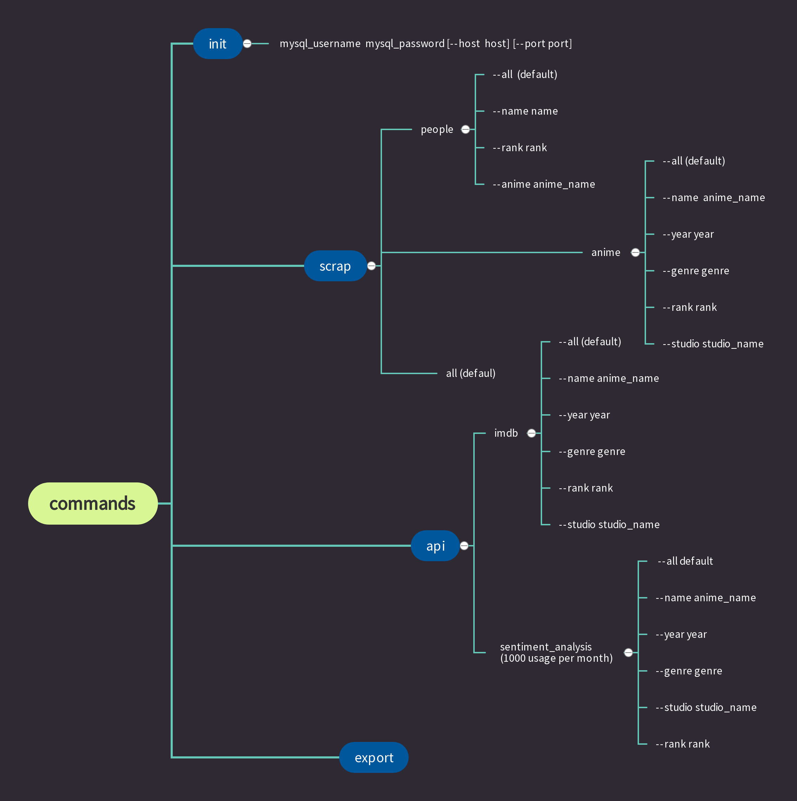

# ITC Data Mining Project: myanimelist.net

*Peng Zhang, Yam Eitan*


**The project scraps, stores and updates data from the website [MyAnimeList](https://www.myanimelist.net).**


## DATA

**Database EDR Diagram:**


Tables and Columns:

- **anime:** id, title, english_title, type, source, start_air, end_air, season_premier, theme, rating, img_url
- **anime_general_stats:** anime_id, score, rating_count, ranked, popularity, members, favorites
- **anime_watch_stats:** anime_id, watching, completed, on_hold, dropped, plan_to_watch, total
- **anime_score_stats:** anime_id, 10, 9, 8, 7,6 ,5 ,4 ,3 ,2 ,1
- **genre:** id, name
- **description:** anime_id, description
- **anime_genre:** match_id, anime_id, genre_id
- **studio:** id, name, rank, favorites, img_url
- **studio_anime:** match_id, studio_id, anime_id
- **people:** id, full_name, birthday, favorites,img_url
- **staff:** match_id, people_id, anime_id
- **character:** id, full_name, favorites, img_url
- **voice_actor:** match_id, character_id, people_id
- **anime_character:** match_id, anime_id, character_id
- **api_imdb:** anime_id, imdb_id, imdb_title, score, year, imdb_url
- **api_description_sentiment_analysis:** anime_id, synopsis_sentiment, confidence

Partial Explanations(table - column):

- **anime - type:** the type of the anime (TV, Movie, OVA, ONA...)
- **anime - source:** what the anime is based of (Manga, Novel, Game...)
- **anime - theme:** the theme of the anime (school, military, zombie, super power...)
- **anime - genre:** the genre of the anime (Adventure, Action, Drama, Boys Love...)
- **\* - favorites:** the number of users added to their favorites
- **anime_general_stats - rating_count:** the number of users who have rated the anime
- **anime_general_stats - members:** the number of the users add the anime to their list
- **anime_general_stats - popularity:** how popular is the anime on the website
- **staff - \*:** the match of people and anime, where the people work as staff(director, key animation, sound
  producer...)
- **voice_actor - \*:** the match of people and character from an anime, where the people work as the voice actor of the
  character.
- **anime_character - \*:** the match of anime and character where the character is from that anime
- **api_description_sentiment_analysis-synopsis_sentiment:** -1-Negative, 0-Neutral, 1-Positive
- **api_description_sentiment_analysis-confidence:** how confident we are about the sentiment classification.
## Usage

1. <b style="color: orange;">Download</b> the entire project (directory) to your local device. **Do not** change project folder name: ITC-DataMining-Project
2. <b style="color: orange;">Initiate</b> the project. (we will explain how to do it in the next section) This will
   initiate Configurations and the MySQL database and insert the __init__datas that we have scraped for you beforehand
   just to make things easier.
3. <b style="color: orange;">Run</b> main.py by giving arguments as commands to instruct what you would like the program
   to do. (Command instructions shown in the following section.)

## Commands

Below is a summary map of how to use the commands. The commands will be updated as we will add more functions and
features to this program.\
\


### First Positional Argument:

For now, there are two possible choicesgt for the first positional argument:

- **init** - This argument is to initiate the project, set up the configuration and database. note: **When running main.py for the first time this argument must be used** also note that while running
  init for the first time a config.json file will be created inside of the directory main is stored in. Changing the
  values in config.json allows the user to configure the web scraper as he likes.
- **scrap** - This argument is to scrap the web pages specified by the commands, and update/insert the data into the database.
- **api** - This argument is to use some external api's to interact with our data.
- **export** - This argument is to export all the data in the database into csv files, each file corresponds to a table in the db.

### Other Positional Arguments:

The possible values of these arguments depend on the value of the first argument.

#### After init
- when we initiate the project, we need to pass parameters for mysql connection.
- mysql_username mysql_password [--h] mysql_host [--p] mysql_port

**Usage example:**
 ```commandline
# initiate project #
ITC-DataMining-Project/main.py init admin 976543

# or #
ITC-DataMining-Project/main.py init root 12345 --host "127.0.0.1" --port 1234
```

#### After scrap

There are three possible values for the second argument (if no value is specified, the program will scrap every
possible):

- **anime** - This will scrap the [anime](https://myanimelist.net/anime/5114/Fullmetal_Alchemist__Brotherhood), [anime_stats](https://myanimelist.net/anime/5114/Fullmetal_Alchemist__Brotherhood/stats) and [studio](https://myanimelist.net/anime/producer/4/Bones) pages, we can specify the **animes** we want to scrap and update: (by) --name, --rank, --year, --genre, --studio. Default(--all) is to scrap for all the animes we have on myanimelist.net. After scraping, it will update/insert the data in the following tables:

| anime             | anime_general_stats |  description |
|-------------------|:-------------------:|-------------:|
| anime_score_stats |  anime_watch_stats  |        genre |
| anime_genre       |       studio        | studio_anime |

 ---
- **people** - This will scrap the data on [people](https://myanimelist.net/people/82/Romi_Park) pages. we can specify the people we want to scrap and update: (by) --name, --rank, --anime. Default(--all) is to scrap for all the people we have on myanimelist.net. After scraping, it will update/insert the data in the following tables:

| people      |      staff      | voice_actor |
|-------------|:---------------:|------------:|
| character   | anime_character |             |
--- 
- **all** - scrap and updates all the related anime and people web pages. _(Be careful!!! This might easily take over 36 hours.)_
---
**Usage example:**
 ```commandline
# scrap anime info by anime_name # 
ITC-DataMining-Project/main.py scrap anime --name "Attack on Titan"

# scrap people info with rank higher than 250 #
ITC-DataMining-Project/main.py scrap people --rank 250

# scrap anime info under Adventure genre #
ITC-DataMining-Project/main.py scrap anime --genre "Adventure"

# scrap people info from an anime #
ITC-DataMining-Project/main.py scrap people --anime "Fullmetal Alchemist"
```

*Notice: every data that is scrapped will be immediately updated in the database.*

---
#### After api
This is to use some external APIs we have integrated in our project to interact with our data.
- **imdb**: this argument use the google search API, which we will search our animes on google search ange get the links to the imdb website, and retrieve the score of the anime.
Exactly like scrap, we can specify the animes we want to search:(by) --name, --rank, --year, --genre, --studio. Default is to search for all the animes we have on myanimelist. It will update/insert the data in the following tables:

| api_imdb  |
|-----------|
---
- **sentiment_analysis:** This argument use the monkeylearn API, on sentiment analysis of the description of the anime. Exactly like scrap, we can specify the animes we want to do sentiment analysis:(by) --name, --rank, --year, --genre, --studio. Default is to do sentiment analysis for all the animes we have on myanimelist. It will update/insert the data in the following tables:

| api_description_sentiment_analysis  |
|-----------|

*Notice: There's only 1000 free usages per month for the sentiment analysis, if you want to use more, register on the [monkeylearn](https://monkeylearn.com/) website, and you can customize the API key for the project in the config.json file.*

---
**Usage example:**
 ```commandline
# Find anime on IMDB with the name Attack on Titan # 
ITC-DataMining-Project/main.py api imdb --name "Attack on Titan"

# Find animes on IMDB with rank higher than 250 on myanimelist.net #
ITC-DataMining-Project/main.py api imdb --rank 250

# Do anime description sentiment analysis on all the animes from the genre Adventure #
ITC-DataMining-Project/main.py api sentiment_analysis --genre "Adventure"
```
## Requirements

to use the progrm the user needs the following python packages installed:

- requierments
beautifulsoup4==4.10.0\
bs4==0.0.1\
fake-useragent==0.1.11\
idna==3.3\
numpy==1.22.3\
pandas==1.4.1\
pathlib2==2.3.7.post1\
PyMySQL==1.0.2\
pytest==7.0.1\
requests==2.27.1\
six==1.16.0\
soupsieve==2.3.1\
SQLAlchemy==1.4.32\
sqlparse==0.4.2\
urllib3==1.26.8\
monkeylearn==3.6.0\
google==3.0.0