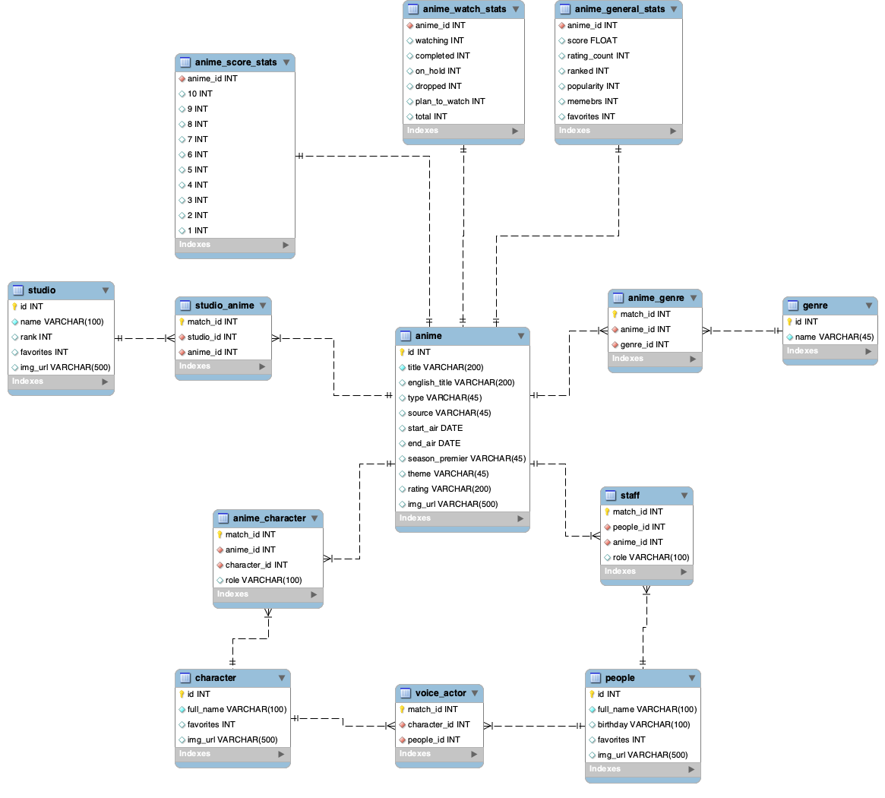

# ITC Data Mining Project: myanimelist.net

*Peng Zhang, Yam Eitan*


**The project scrapes, stores and updates data from the website [MyAnimeList](https://www.myanimelist.net).**


## DATA

**Database EDR Diagram:**



Tables and Columns:

- **anime:** id, title, english_title, type, source, start_air, end_air, season_premier, theme, rating, img_url
- **anime_general_stats:** anime_id, score, rating_count, ranked, popularity, members, favorites
- **anime_watch_stats:** anime_id, watching, completed, on_hold, dropped, plan_to_watch, total
- **anime_score_stats:** anime_id, 10, 9, 8, 7,6 ,5 ,4 ,3 ,2 ,1
- **genre:** id, name
- **anime_genre:** match_id, anime_id, genre_id
- **studio:** id, name, rank, favorites, img_url
- **studio_anime:** match_id, studio_id, anime_id
- **people:** id, full_name, birthday, favorites,img_url
- **staff:** match_id, people_id, anime_id
- **character:** id, full_name, favorites, img_url
- **voice_actor:** match_id, character_id, people_id
- **anime_character:** match_id, anime_id, character_id

Partial Explanations(table - column):

- **anime - type:** the type of the anime (TV, Movie, OVA, ONA...)
- **anime - source:** what the anime is based of (Manga, Novel, Game...)
- **anime - theme:** the theme of the anime (school, military, zombie, super power...)
- **anime - genre:** the genre of the anime (Adventure, Action, Drama, Boys Love...)
- **\* - favorites:** the number of users added to their favorites
- **anime_general_stats - rating_count:** the number of users who have rated the anime
- **anime_general_stats - members:** the number of the users add the anime to their list
- **anime_general_stats - popularity:** how popular is the anime on the website
- **staff - \*:** the match of people and anime, where the people work as staff(director, key animation, sound
  producer...)
- **voice_actor - \*:** the match of people and character from an anime, where the people work as the voice actor of the
  character.
- **anime_character - \*:** the match of anime and character where the character is from that anime

## Usage

1. <b style="color: orange;">Download</b> the entire project (directory) to your local device.
2. <b style="color: orange;">Initiate</b> the project. (we will explain how to do it in the next section) This will
   initiate Configurations and the MySQL database and insert the __init__datas that we have scraped for you beforehand
   just to make things easier.
3. <b style="color: orange;">Run</b> main.py by giving arguments as commands to instruct what you would like the program
   to do. (Command instructions shown in the following section.)

## Commands

Below is a summary map of how to use the commands. The commands will be updated as we will add more functions and
features to this program.\
\


### First Positional Argument:

For now, there are two possible choices for the first positional argument:

- **init** - This argument is used to set up the configuration and database either loacally or remotely(currently
  unavailabe). note: **When running main for the first time this argument must be used** also note that while running
  init for the first time a config.json file will be created inside of the directory main is stored in. changing the
  values in config.json allows the user to configure the web scraper as he likes.
- **scrap** - this argument is used to scrap the web page according to commands, and update the data in the database
  db_myanimelist.

Init Example:

 ```python
# initiate project locally 
ITC-DataMining-Project/main.py init local admin 976543

# or
ITC-DataMining-Project/main.py init local root 12345 --host "127.0.0.1" --port 1234
```

### Second Positional Argument:

The possible values of this argument depend on the value of the first argument.

#### After Using init

there are two possible values for the second argument:

- local- This will setup the anime database locally on the users computer. after using loacl the user must provide a
  username and password, and optionally a host name (which by default is "host")
- remote(unavailable) - This will setup the anime database remotely. Much like the previous case, after using remote the
  user must provide a username and password, and optionally a host name (which by default is "host")

here are usage examples of bth cases:

#### After Using scrap

There are three possible values for the second argument (if no value is specified, the program will scrap every
possible):

- **anime** - This will update only information available in the anime info and anime stats pages. if the user would
  like to update a more specifc category of anime the following flags are availabe: --name, --rank ,--year, --genre,
  --studio. if non of this is specified the tables above will be completely updated.
- **people** - This will update only information available in the people pages. if the user would like to update a more
  specifc category of people the following flags are availabe: --name, --rank (updates all people this rank or higher)
  ,--anime (only updates people who were staff in a certain anime provided by anime name) if non of this is specified
  the tables above will be completely updated.

- **all** - scrap and updates all the related web pages. _(Be careful!!! This might easily take over 30 hours.)_

Scrap examples:

 ```python
# scrap anime info by anime_name  
ITC-DataMining-Project/main.py scrap anime --name "Attack on Titan"

# scrap people info with rank higher than 250
ITC-DataMining-Project/main.py scrap people --rank 250

# scrap anime info under Adventure genre
ITC-DataMining-Project/main.py scrap anime --genre "Adventure"
```

Since the website is constantly updating, this will collect the data from the relative web pages, and after clean the
data, they will be updated in the database.

## How we do it? (Steps and Progress)

<b style="color: orange;">_(The following part is still under edition, and will be changed as the project
advances.)_ </b>

### 1. Collecting Data

We first Notice there are 6 types of pages in MyAnimeList from which we wanted to get information:

- anime list page (e.g. [link](https://myanimelist.net/topanime.php))
- people list page (e.g. [link](https://myanimelist.net/people.php))
- anime main page (e.g. [link](https://myanimelist.net/anime/43608/Kaguya-sama_wa_Kokurasetai__Ultra_Romantic))
- anime stat page (e.g. [link](https://myanimelist.net/anime/43608/Kaguya-sama_wa_Kokurasetai__Ultra_Romantic/stats))
- people main page (e.g. [link](https://myanimelist.net/people/118/Hiroshi_Kamiya))

We first used the Requests module along with the fake-useragent module and the free proxy list
provided [here](https://www.sslproxies.org/) to create random proxy and header generators so that we will be able to
scrap the website without being blocked.

We then used BeautifulSoup to write a scraper for each type of page which extracts the information we are interested in.
For the first two types of pages, the information is a list of other links, while for the last three, it is a fixed
length tuple of dictionaries. Each dictionary represents information which will later be stored in its own csv file.

We then created functions to create and store our extracted information in several csv files and use pandas to reformat
and prepare them to be uploaded to a mysql database.All files are stored in a new directory called init_datas and come
with the main download of the program, but could be recreated using other modules in the main file. We then use
SQLAlchemy to store the data into the following EDR:

Four additional text files containig a list of all proxies, a list of all anime page links, a list of all people page
links, and a list of all errors that occured during running the program will also be created.

The program was wraped for user interface using argparse, using the arguments decribes in the usage section, the user
can set up the database in mysql and then update it fully or partially based on several options.

## Requirements.

to use the progrm the user needs the following python packages installed:

- requierments
- bs4
- fake-useragent
- pathlib2
- pandas
- SQLAlchemy
- sqlparse
- argparse
- pymysql
- logging